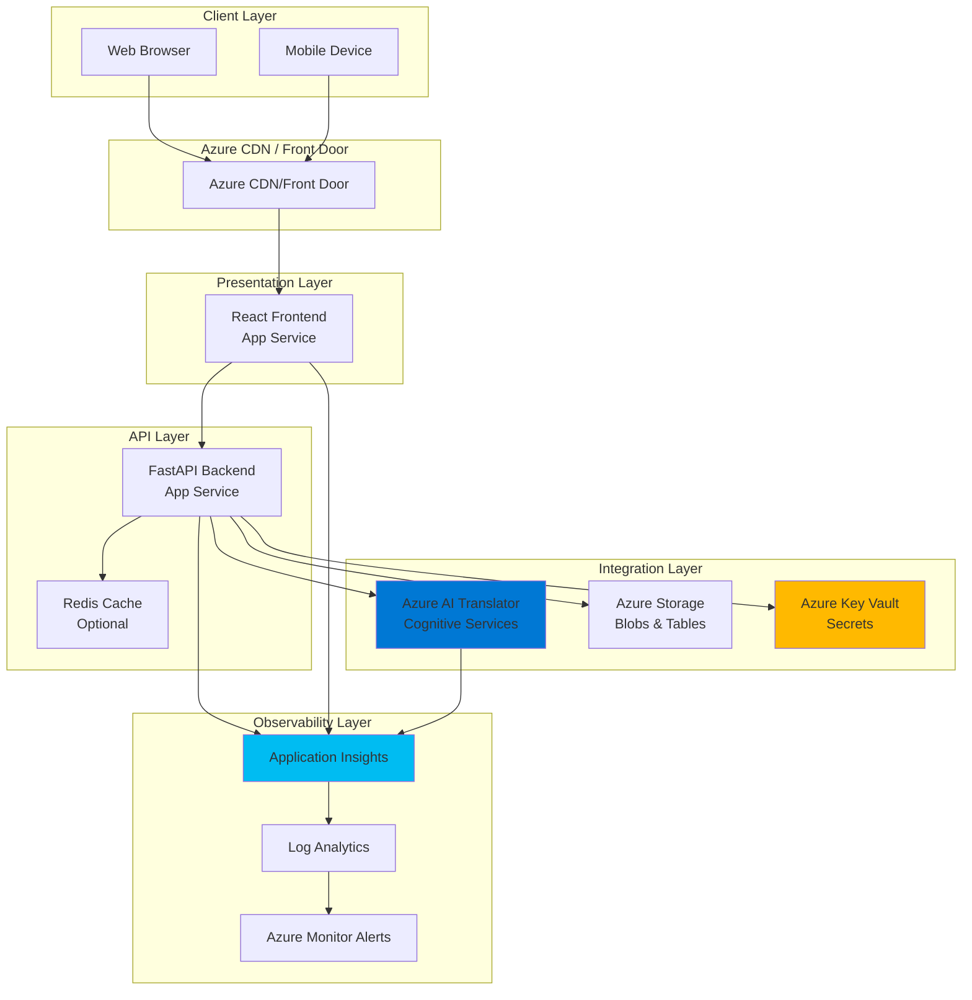
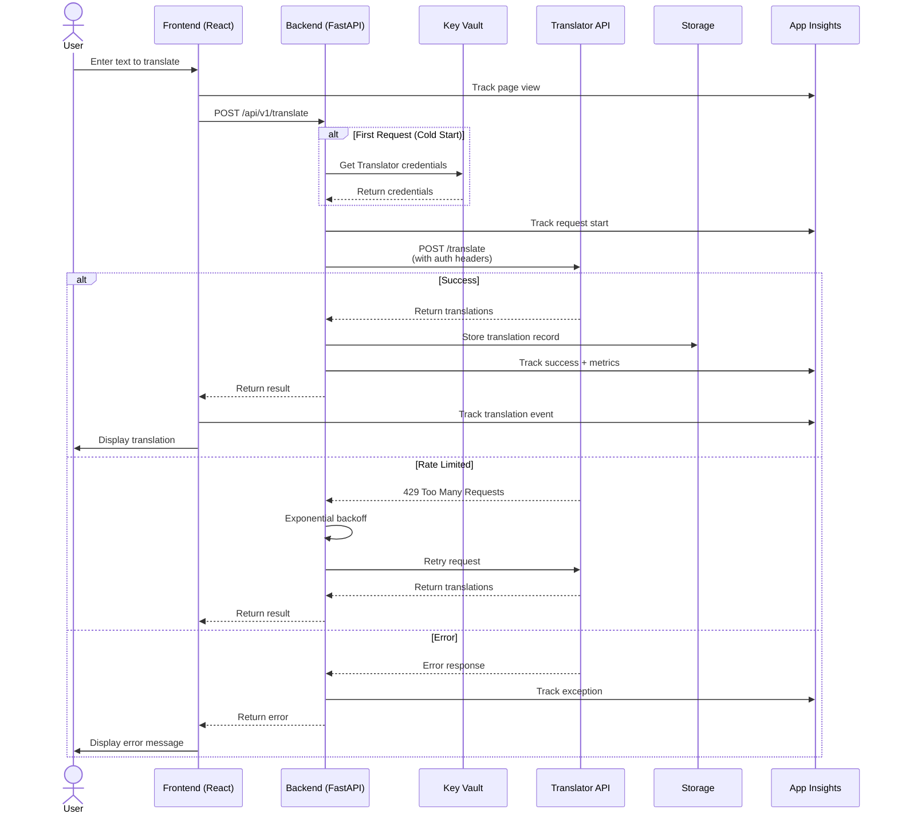
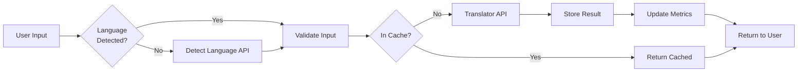
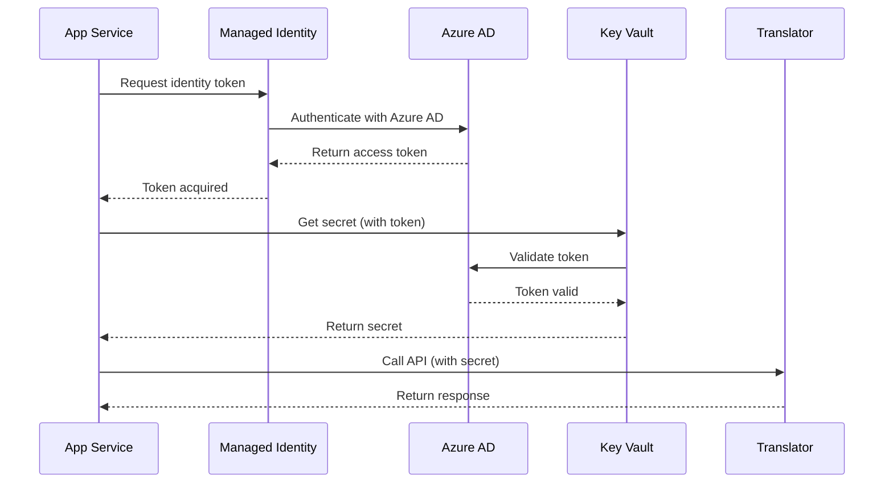

# Architecture Documentation

## Overview

The Azure Translator Solution Accelerator is a production-grade reference implementation demonstrating best practices for integrating Azure AI Translator Service into modern web applications. The architecture follows Azure Well-Architected Framework principles: reliability, security, cost optimization, operational excellence, and performance efficiency.

## System Architecture

### High-Level Architecture



### Component Interaction Sequence



## Component Details

### Frontend (React + TypeScript)

**Technology Stack:**
- React 18 with TypeScript
- Vite for build tooling (fast HMR)
- TanStack Query for data fetching and caching
- i18next for internationalization
- Application Insights SDK for telemetry

**Key Features:**
- Responsive design (mobile-first)
- Real-time translation with debouncing
- Language auto-detection
- Translation history
- Accessibility (WCAG 2.1 AA)
- Progressive Web App capabilities

**Build Output:**
- Static files deployed to Azure App Service or Azure Static Web Apps
- Optimized bundles with code splitting
- CDN-ready with cache headers

### Backend (Python + FastAPI)

**Technology Stack:**
- Python 3.11+
- FastAPI web framework
- Pydantic for data validation
- httpx for async HTTP calls
- Azure SDKs for service integration
- OpenTelemetry for distributed tracing

**API Endpoints:**

| Endpoint | Method | Description |
|----------|--------|-------------|
| `/api/v1/translate` | POST | Translate text to one or more languages |
| `/api/v1/detect` | POST | Detect language of input text |
| `/api/v1/transliterate` | POST | Transliterate text between scripts |
| `/api/v1/dictionary/lookup` | POST | Dictionary lookup for translations |
| `/api/v1/dictionary/examples` | POST | Get usage examples for translations |
| `/api/v1/languages` | GET | List all supported languages |
| `/api/v1/languages/{scope}` | GET | Get languages for specific scope |
| `/health` | GET | Health check endpoint |
| `/metrics` | GET | Prometheus metrics |

**Authentication:**
- Azure Managed Identity (production)
- API key (local development)
- Optional: JWT tokens for user authentication

**Rate Limiting:**
- Application-level throttling (60 req/min default)
- Exponential backoff on 429 responses
- Circuit breaker pattern for fault tolerance

### Azure AI Translator

**Service Tier:**
- Dev: F0 (Free) - 2M characters/month
- Prod: S1 (Standard) - Pay-as-you-go

**API Version:** v3.0

**Key Capabilities Implemented:**
1. **Text Translation** - Translate between 100+ languages
2. **Language Detection** - Automatic source language identification
3. **Transliteration** - Script conversion (e.g., Arabic to Latin)
4. **Dictionary** - Alternative translations and usage examples
5. **Batch Processing** - Translate multiple texts in one request

**Authentication:**
- Subscription key (Ocp-Apim-Subscription-Key header)
- Region header (Ocp-Apim-Subscription-Region)

**Endpoints Used:**
```
https://api.cognitive.microsofttranslator.com/translate?api-version=3.0
https://api.cognitive.microsofttranslator.com/detect?api-version=3.0
https://api.cognitive.microsofttranslator.com/transliterate?api-version=3.0
https://api.cognitive.microsofttranslator.com/dictionary/lookup?api-version=3.0
https://api.cognitive.microsofttranslator.com/dictionary/examples?api-version=3.0
https://api.cognitive.microsofttranslator.com/languages?api-version=3.0
```

### Azure Key Vault

**Purpose:**
- Secure storage of Translator API keys
- Storage connection strings
- Application secrets

**Access Pattern:**
- Managed Identity authentication (no keys in code)
- Key Vault references in App Service configuration
- Automatic secret rotation support

**Key Vault Structure:**
```
translator-api-key         → Azure Translator subscription key
translator-region          → Azure region (e.g., westeurope)
storage-connection-string  → Azure Storage connection string
appinsights-connection-string → Application Insights connection
```

### Azure Storage

**Storage Account Configuration:**
- Dev: Standard LRS
- Prod: Standard GRS

**Containers:**
1. **translations** - Translation history and audit logs
2. **cache** - Optional caching layer (alternative to Redis)
3. **exports** - Batch translation results

**Table Storage:**
- **TranslationHistory** - Audit trail with timestamp, source/target languages, character count
- **QuotaTracking** - Daily/monthly usage tracking

### Application Insights

**Telemetry Collected:**
- Request/response logs with duration
- Dependency calls (Translator API, Storage, Key Vault)
- Custom events (translation completed, language detected)
- Custom metrics (character count, language pairs, cache hit rate)
- Exceptions and error rates
- Performance counters

**Distributed Tracing:**
- Correlation IDs across frontend and backend
- End-to-end transaction tracking
- Dependency map visualization

**Dashboards:**
- Real-time translation volume
- Language pair popularity
- API latency percentiles (p50, p95, p99)
- Error rate by error type
- Cost tracking (character count → pricing)

## Data Flow

### Translation Request Flow



### Authentication Flow (Production)



## Security Architecture

### Security Layers

1. **Network Security**
   - HTTPS only (TLS 1.2+)
   - Optional: VNet integration for private connectivity
   - Optional: Private endpoints for Azure services

2. **Identity & Access**
   - Managed Identity for Azure resource access
   - Azure AD integration for user authentication (optional)
   - RBAC for infrastructure management

3. **Secrets Management**
   - No secrets in code or configuration files
   - Key Vault for all sensitive data
   - Automatic secret rotation

4. **Data Protection**
   - Encryption at rest (Azure Storage, Key Vault)
   - Encryption in transit (TLS)
   - No PII stored without explicit consent

5. **Application Security**
   - Input validation (Pydantic models)
   - Output encoding (prevent XSS)
   - CORS policy enforcement
   - Rate limiting and throttling

### Threat Model

| Threat | Mitigation |
|--------|-----------|
| API key exposure | Key Vault + Managed Identity, no keys in code |
| Excessive API usage | Rate limiting, quota tracking, alerts |
| DDoS | Azure DDoS Protection, rate limiting |
| SQL Injection | No SQL database; if added, use parameterized queries |
| XSS | Content Security Policy, React auto-escaping |
| CSRF | SameSite cookies, CSRF tokens if stateful |
| Man-in-the-middle | HTTPS only, HSTS headers |

## Scalability & Performance

### Horizontal Scaling

**App Service Autoscaling Rules:**
- Scale out: CPU > 70% for 5 minutes
- Scale in: CPU < 30% for 10 minutes
- Min instances: 1 (dev), 2 (prod)
- Max instances: 3 (dev), 10 (prod)

**Stateless Design:**
- No server-side sessions
- JWT tokens for authentication (if implemented)
- Shared storage for any persistent state

### Caching Strategy

**Levels:**
1. **Browser Cache** - Static assets (24h)
2. **CDN Cache** - Frontend bundles (7d)
3. **Application Cache** - Redis/Storage (1h for translations)
4. **HTTP Cache** - ETag/If-None-Match for API responses

**Cache Invalidation:**
- Language list: 24 hours (rarely changes)
- Translations: 1 hour (deterministic results)
- User-specific data: No caching

### Performance Targets

| Metric | Target | Measurement |
|--------|--------|-------------|
| API Latency (p95) | < 500ms | Application Insights |
| Frontend FCP | < 1.5s | Lighthouse |
| Frontend TTI | < 3.0s | Lighthouse |
| Translation Throughput | > 100 req/sec | Load testing |
| Error Rate | < 0.1% | Application Insights |
| Availability | > 99.9% | Azure Monitor |

## Cost Architecture

### Cost Breakdown (Monthly Estimates)

**Development Environment:**
| Service | SKU | Cost |
|---------|-----|------|
| Translator | F0 (2M chars) | $0 |
| App Service | F1 Free | $0 |
| Storage | LRS (1 GB) | $0.50 |
| Key Vault | Standard | $0.50 |
| App Insights | Basic (1 GB) | $2.30 |
| **Total** | | **~$3.30** |

**Production Environment (Low Traffic):**
| Service | SKU | Estimated Cost |
|---------|-----|----------------|
| Translator | S1 (2M chars) | $10 |
| App Service | P1v3 | $80 |
| Storage | GRS (10 GB) | $2 |
| Key Vault | Standard | $1 |
| App Insights | Pay-as-you-go (5 GB) | $11.50 |
| Azure Front Door | Classic (50 GB) | $35 |
| **Total** | | **~$139.50** |

**Production Environment (High Traffic):**
- Translator: S1 at scale (~100M chars): $500
- App Service: P2v3 autoscale (avg 4 instances): $640
- Redis Cache: Basic C1: $30
- Total: **~$1,300/month**

### Cost Optimization Strategies

1. **Use Free Tiers for Dev** - Translator F0, App Service F1
2. **Implement Caching** - Reduce API calls by 40-60%
3. **Batch Translations** - 1 API call instead of N calls
4. **Right-size Compute** - Use B-series for dev, scale prod as needed
5. **Monitor Quotas** - Alert before exceeding limits
6. **Use Reserved Capacity** - 30-40% savings for predictable workloads
7. **Auto-shutdown Dev Resources** - Schedule off-hours shutdown

## Disaster Recovery & Business Continuity

### Backup Strategy

- **Infrastructure**: IaC in Git (redeployable)
- **Configuration**: Key Vault secrets, App Service settings
- **Data**: Storage replication (GRS in prod)
- **Application Code**: Git repository

### Recovery Point Objective (RPO)

- Infrastructure: 0 (IaC)
- Translation History: 1 hour (Storage geo-replication lag)
- Application State: 0 (stateless design)

### Recovery Time Objective (RTO)

- Infrastructure Redeployment: < 30 minutes
- Application Redeployment: < 10 minutes
- DNS Failover: < 5 minutes
- **Total RTO: < 45 minutes**

### High Availability

**Single Region:**
- App Service: 99.95% SLA (2+ instances)
- Translator: 99.9% SLA
- Storage: 99.9% SLA (LRS)

**Multi-Region (Future):**
- Azure Front Door for global load balancing
- Active-passive or active-active deployment
- 99.99%+ availability

## Operational Excellence

### Deployment Strategy

**Environments:**
1. **Development** - Feature development and testing
2. **Production** - Live user traffic

**Deployment Pipeline:**
```
Code Commit → CI Tests → Build → Dev Deploy → Integration Tests → Manual Approval → Prod Deploy → Smoke Tests
```

**Blue-Green Deployment (Prod):**
- Deploy to staging slot
- Run smoke tests
- Swap slots (zero downtime)
- Rollback capability within minutes

### Monitoring & Alerting

**Key Metrics:**
- Request rate and latency
- Error rate and types
- Translator API quota usage
- Cost tracking
- User engagement

**Alert Rules:**
| Alert | Condition | Action |
|-------|-----------|--------|
| High Error Rate | > 5% errors for 5 min | PagerDuty notification |
| API Quota | > 80% of daily quota | Email team |
| High Latency | p95 > 2s for 10 min | Slack notification |
| Service Down | Health check fails 3x | PagerDuty + auto-scale |
| High Cost | > $200/day | Email finance team |

### Runbooks

- **Service Outage Response** - docs/runbooks/outage.md
- **Performance Degradation** - docs/runbooks/performance.md
- **Quota Exceeded** - docs/runbooks/quota.md
- **Security Incident** - docs/runbooks/security.md

## Future Enhancements

### Phase 2 Roadmap

1. **Document Translation**
   - Integrate Azure Translator Document Translation API
   - Support PDF, DOCX, PPTX formats
   - Asynchronous job processing

2. **Custom Models**
   - Azure Translator Custom Translation
   - Domain-specific terminology
   - Training data management

3. **Advanced Caching**
   - Azure Cache for Redis
   - Intelligent cache warming
   - Multi-level cache hierarchy

4. **Multi-Region Deployment**
   - Azure Front Door global load balancing
   - Regional failover
   - Data residency compliance

5. **Enhanced Analytics**
   - Power BI dashboards
   - ML-driven usage predictions
   - Cost optimization recommendations

6. **Mobile Apps**
   - React Native mobile apps
   - Offline translation capability
   - Camera-based OCR + translation

## References

- [Azure Well-Architected Framework](https://learn.microsoft.com/azure/architecture/framework/)
- [Azure Translator Documentation](https://learn.microsoft.com/azure/ai-services/translator/)
- [FastAPI Best Practices](https://fastapi.tiangolo.com/deployment/)
- [React Performance Optimization](https://react.dev/reference/react)
- [Azure Security Baseline](https://learn.microsoft.com/security/benchmark/azure/)

---

**Document Version:** 1.0  
**Last Updated:** 2025-10-10  
**Maintained By:** Architecture Team

